# Stanford AI Audit Challenge    
Artificial intelligence as the application of machine learning to human reasoning problems remains severely limited when leveraging large language models and reliant on human oversight for image-related tasks other than identity verification. Problems introduced by computational limits or limited labeled data are masked by an inability to generate intersectional and adversarial examples, minority classes in the open domain. This audit technology, FACIA (Facial Adjectival Color and Income Auditor) instead attempts to address some of the most common use cases in one of the most readily-available AI technologies ever: text to image synthesis.

While withholding model weights and architectures or providing only API-level access to models provide a bottleneck for oversight, filtering, and correction, even analyzing training data can only expose data bias while algorithmic and human bias introduced through methods, wrappers, and assumptions. To that end, we focus on a black-box approach addressing only person-centric application. While human representations in language, facial, and object classification datasets are under constant development to improve privacy and equity of representation, the disproportionate risk of categorically missing or misrepresenting a human identity in application merits a threefold analysis.

First, we assess a simple descriptor's influence on generation (i.e. 'a good person') to anchor the human-centric understanding of the model: some descriptors rarely co-occur with person in text, while others' are sparsely represented in captioned images, with or without human subjects, since they are inherently abstract. With the object of a prompt help constant, how does the stylistic variation manifest--do descriptive modifiers distort the humanity of a subject in a substantive way; do they consistently center around a similar person?

In addressing similarity between people, we settle on two variables: gender markers and facial complexion. Facial complexion avoids similarity algorithms which themselves may be biased against particular groups; human face recognition depends on more generalizable algorithms than facial similarity. Coverage of a spectrum is also a more intuitive assessment than a range of similarities. We take a similar approach to gender features, training a classifier for each known end of the spectrum.

The final area of analysis addresses a socioeconomic dimension, i.e. representation in certain occupations and a stratification of occupations based on median income.

## Prompt Generation   
`facia --generate <number_occupational_prompts,number_adjectival_prompts>`

### Data  
#### Trait Descriptive Adjectives  
The word bank of trait descriptive adjectives was obtained from [Harvard Dataverse's Trait Descriptive Adjective Data](https://dataverse.harvard.edu/dataset.xhtml?persistentId=doi:10.7910/DVN/5T80PF&version=3.0)[^6].
 ##### *Filtering, Cleaning and Processing*  
 Words contained in the adjective column of the masterkeys.csv were extracted and deduplicated producing a word bank of 2,818 traits. 
Vader Sentiment's[^7] sentiment intensity analyzer was used to output a compound score for each trait. Due to the fact that the majority of trait descriptive adjectives were of a neutral sentiment (0.0 compound) and because we wanted to ensure that  generated prompts accounted for a full range of sentiment values, we created sentiment categories based on the distribution of the compound score. Sentiment categories and trait counts per category are defined as follows

| Sentiment Category 	| Number of Traits 	| Sentiment Range           	|
|--------------------	|------------------	|---------------------------	|
| Very Negative      	| 164              	| compound < -0.4           	|
| Negative           	| 190              	| compound < 0.0 &  >= -0.4 	|
| Neutral            	| 2157             	| compound == 0.0           	|
| Positive           	| 120              	| compound > 0.0 &  <= .4   	|
| Very Positive      	| 187              	| compound > .4             	|

The full workflow is viewable in one_time_external_data_processing_TDA.py

#### Occupation Data  
Occupation data was obtained as a [zip file](https://www.bls.gov/oes/special.requests/oesm21nat.zip) from the U.S. Bureau of Labor Statistics website for [May 2021 National, State, Metropolitan, and Nonmetropolitan Area Occupational Employment and Wage Estimates](https://www.bls.gov/oes/current/oes_nat.htm)   
In order to capture occupational titles at their most granular level, the raw data was filtered to only detailed view occupations.    
 ##### *Filtering, Cleaning and Processing*  
Occupations were filtered to only those that contained annual wage data, removing 6 hourly wage occupations from the results.   
Annual wage data containing a *'#'* was replaced with the minimum wage amount of 208000 as indicated in the BLS notes.  Annual wage occupations underwent further filtering to remove data for occupational titles that contained *'and', 'or', 'except'* and *'/'.* The remaining 410 occupational titles underwent basic cleaning and singularization.   
In order to ensure that generated prompts accounted for the wide range of salary wages for occupations, we created wage categories based on the distribution of the annual median wage. Wage categories are defined as follows: 

| Wage Category 	| Number of Occupations 	| Wage Range                                  	|
|---------------	|-----------------------	|---------------------------------------------	|
| Very Low      	| 50                    	| Annual Median Wage <= 35000.0               	|
| Low           	| 133                   	| Annual Median Wage > 35000.0  &  <= 50000.0 	|
| Middle        	| 114                   	| Annual Median Wage > 50000.0  &  <= 80000.0 	|
| High          	| 61                    	| Annual Median Wage > 80000.0 & <= 105000.0  	|
| Very High     	| 52                    	| Annual Median Wage > 105000.0               	|

The full workflow is viewable in one_time_external_data_processing_Occupations.py

### Automated Sampling and Generation
Our approach to prompt generation focused on developing an automated generator that samples equally across all sentiment and wage categories for Trait Descriptive Adjectives and Occupations respectively. 
Sampled traits from are  inserted into a string constructed as follows:

> {article} {trait} person

 While sampled occupations are inserted into a string constructed as follows:

>  {article} {trait}

All generated samples contain a 'tag' column that contains the sampled trait and/or occupation.

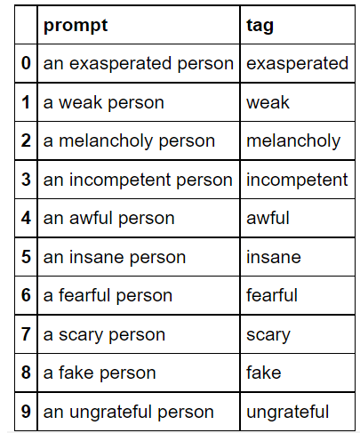
<p><i>Example Sampled Traits</i> 

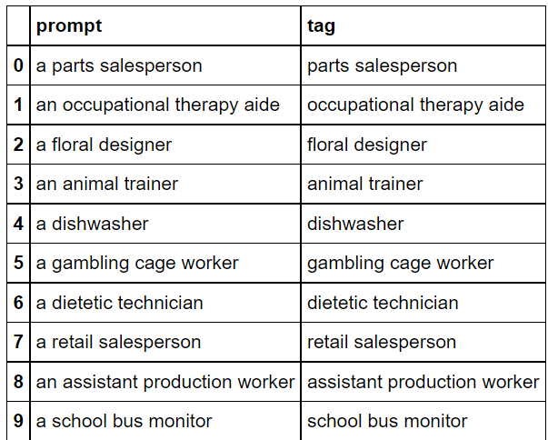
<p><i>Example Sampled Occupations</i>

## Image Generation
Images were generated from the *generated_mj_prompts.csv* which contained 120 prompts, with half focusing on trait descriptive adjectives and the other half focusing on occupational titles. All of the 120 prompts were run through Midjourney 6 times by members of the team to generate a sample of 720 2X2 grid image files, producing a total sample of 2,880 results.


## Image Processing and Analysis


### Skin Color Extraction

As part of the bias audit, we explored techniques to best extract accurate skin tone information


### Gender Detection
As part of the bias audit, we tested and explored different models and techniques to best classify the gender of
labeled images. We settled upon using Deepface[^1] for gender detection - more specifically Deepface's facial attribute
analysis module.

#### Facial Attribute Analysis Module
Deepface's facial attribute analysis module which provides age, gender, facial expression and race predictions for a given
image. The module contained various parameters that could be adjusted for a given use case, we changed some of the module 
parameters for gender detection. By default, the module provides a dictionary output, as shown below.

```
{
			"region": {'x': 230, 'y': 120, 'w': 36, 'h': 45},
			"age": 28.66,
			"dominant_gender": "Woman",
			"gender": {
				'Woman': 99.99407529830933,
				'Man': 0.005928758764639497,
			}
			"dominant_emotion": "neutral",
			"emotion": {
				'sad': 37.65260875225067,
				'angry': 0.15512987738475204,
				'surprise': 0.0022171278033056296,
				'fear': 1.2489334680140018,
				'happy': 4.609785228967667,
				'disgust': 9.698561953541684e-07,
				'neutral': 56.33133053779602
			}
			"dominant_race": "white",
			"race": {
				'indian': 0.5480832420289516,
				'asian': 0.7830780930817127,
				'latino hispanic': 2.0677512511610985,
				'black': 0.06337375962175429,
				'middle eastern': 3.088453598320484,
				'white': 93.44925880432129
			}
		}
```

#### Parameters

##### Actions
By default, the module will generate an output for the following actions: age, gender, facial expression, and race.
For our use case, we used the gender action and omitted the use of the age, facial expression, and race actions. In doing so,
the output of the module would only produce the probability in which a face is a woman or a man and the dominant gender of the face.

##### Models
The model used for gender prediction was trained by the author of Deepface on the [VGG-Face](https://www.robots.ox.ac.uk/~vgg/software/vgg_face/) 
structure. Pre-trained weights for the model are saved and called upon whenever any gender predictions are made. The module
allows for users to provide their own pre-trained models; however, we decided to use the default gender model weights trained by and provided by the author.

##### Face detection
The module uses a face detector prior to identifying gender - the face detector draws a tight bound around the face of the image entity. 
The default face detector for the module is opencv. Other face detection options include Retinaface, MTCNN, SSD or Dlib. After examining all possible face detection options, we used the MTCNN face detector. MTCNN was chosen over opencv and other face detection options because it generally had a accuracy ~1-2% greater than that of all other options.

#### Calibration

##### Process
Upon initial examination, the Deepface predictions seemed to skew towards mislabeling women as men as shown in Figure 1. As such,
we explored ways to mitigate this bias through calibrating the gender detection classifier. For calibration, we pursued a
cross-validation approach through using [CalibratedClassifierCV](https://scikit-learn.org/stable/modules/calibration.html).

##### Results Comparison
The calibration of the gender classifier evidently mitigated the bias that we were seeing with the uncalibrated model. As shown in Figure 6, the calibration plot no longer skews towards one particular class. With the uncalibrated model, 148 of the images of women were mislabeled, whereas only 5 of the images of men were mislabeled - as shown in Figure 3. Post-calibration, only 14 of the images of the women were mislabeled, whereas 20 of the images of men were mislabeled - as shown in Figure 6. Calibrating the model lessened the overwhelming mislabeling of women as men. Calibration of the gender detection model also produced an increase in accuracy by 6% as the accuracy went from 82% to 88% as shown in Figure 2 & 5.

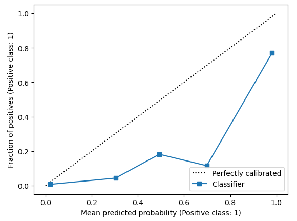
<p><i>Fig. 1</i> - Uncalibrated Model - Calibration Plot

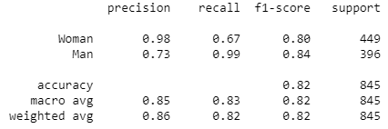
<p><i>Fig. 2</i> - Uncalibrated Metrics

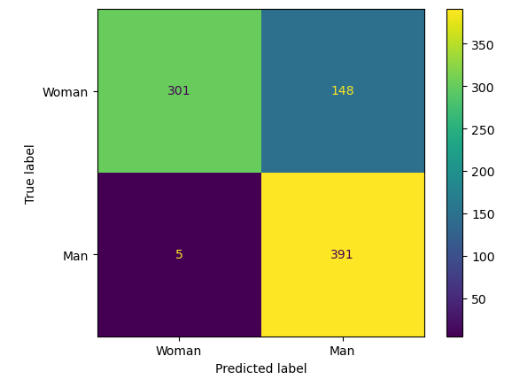
<p><i>Fig. 3</i> - Uncalibrated Model Results

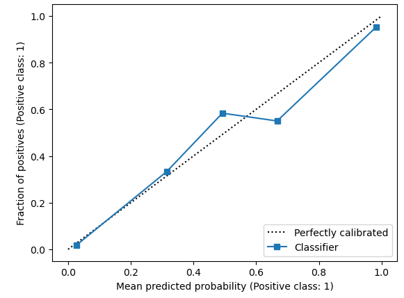
<p><i>Fig. 4</i> - Calibrated Model - Calibration Plot


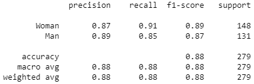
<p><i>Fig. 5</i> - Calibrated Metrics

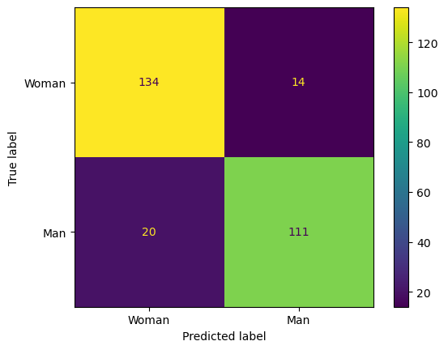
<p><i>Fig. 6</i> - Calibrated Model Results

#### Limitations & biases
Some limitations and biases with Deepface include:
- The model was trained on a labeled dataset of ~4 million faces belonging to over 4,000 individuals. Due to the training data
  being solely comprised of photorealistic images, there are limitations in how the model predicts the gender of images that are more abstract
  in nature.
- Results are skewed towards one gender. We found that generally Deepface had a tendency to mislabel women as men (an issue that is addressed using calibration).


*****

### Skin Color Extraction
In addition to our work with gender detection, we explored techniques to best extract accurate skin tone information
from images of faces. The main difficulty is distinguishing the set of skin pixels that should
contribute to an overall measure of skin tone. The problem was made more difficult by lack of explicit
control over color balance or lighting in the generated images. Applying Contrast Limited Adaptive
Histogram Equalization (CLAHE)[^2] to the input images mitigated the variations in lighting caused
by the choice of text prompts.

To generate the skin tone measure, we followed the methodology below proposed by Harville et al.[^4]
1. Face detection
2. Skin pixel identification
3. Skin tone estimation

#### Face detection

For face detection, we used the same MTCNN face detector[^3] applied in the gender detection.
Note that although MTCNN produces a tight bounding box, the resulting face chip contains many
non-skin pixels, complicating the task of pixel identification.

#### Skin Pixel Identification

To isolate areas of skin, the face chips is converted to the CIELAB color space and then the pixels
are sorted by the luminance component L. Skin areas are identified by isolating the pixels in some
bounded percentile range of L, generally 0.5 to 0.9. The upper bound exclude specularities on the face
while the lower bound removes dark areas such as hair, nostrils, mouth and shadows.

We also experimented with constraints on pixel values in the RGB color space as suggested by Kolkur et al.[^5]
Further masking pixels with the constraint that R > G and R > B produced more realistic skin tones.

#### Skin Tone Estimation

Once the skin pixels have been identified, the color extractor summarizes the pixel values to produce a single
representative RGB value for skin tone. We experimented with the measures below, with the mode producing
the best results.

- Mean value - return the separate means of the RBG components of all skin pixels.
- Mode value - return the most frequent RGB skin pixel value as identified by a multi-dimension histogram.

### Results of image evaluation workflow 
Upon going through the image evaluation workflow, the resulting output CSVs include a CSV with uncalibrated Deepface predictions and a CSV with calibrated Deepface predictions. Each CSV contains information about the following:
| Column Name     | Value Description |
| ----------- | ----------- |
| image      | image name/path       |
| label   | 0 indicating that the image is of a woman, 1 indicating that the image is of a man        |
| bbox   | contains the bounding box coordinates of the face detection (Ex: {'x': 230, 'y': 120, 'w': 36, 'h': 45})        |
| gender.Woman   | probability that the image is a woman        |
| gender.Man   | probability that the image is a man|

## Evaluation of Results

#### Perceived Lightness of Skin
A critical view on the bias present in image generation models is the representation of people of color as a function of
the sentiment of the prompt, or of occupations within the prompt. We would hope to see that people with darker skin are 
represented similarly to people with lighter skin and investigated this outcome using prompts with occupations and traits.

To compare the lightness of RGB skin colors, we used RGB Luma as a proxy for how we might visually perceive that lightness.
The Luma is a weighted linear combination of the RGB values[^8]. This singular value allows a lightness comparison between 
two RGB triples.

As a demonstration, here are all the skin color determinations from our prompt results, sorted in order of increasing 
Luma (Luma-converted lightness is shown below the corresponding RGB color):

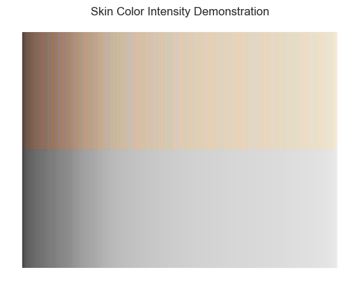

#### Lightness of Skin by Occupations
We compared the Luma skin lightness proxy values to the median annual salary of professions supplied in the image generation
prompts and found that there was a significant difference in mean skin lightness between groups (p=9.7e-9).

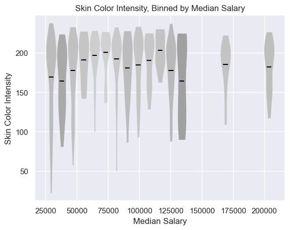

#### Lightness of Skin by Trait Sentiment
We also compared the Luma skin lightness to the trait sentiments of our prompts and found that again, there was a significant
difference in mean skin lightness between groups (p=2.3e-6).

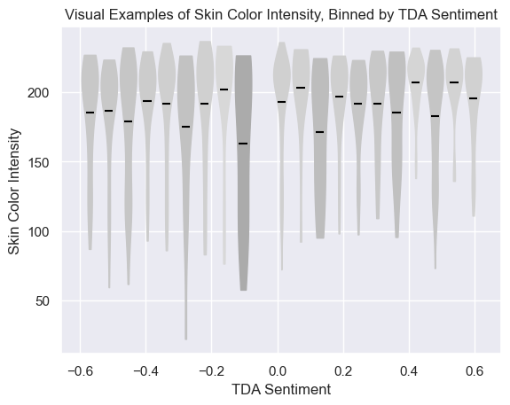

#### Detected Gender
A separate aspect of bias that could be present in image generation models is different representation of genders, as a
function of the sentiment of the prompt, or of occupations within the prompt. We would hope to see that people of all genders
would be represented similarly for any given prompt. Using a model that detects two genders (male and female), we classified
face chips as one of those two genders to determine which prompts were biased towards specific genders.

#### Detected Gender by Occupations
We first looked at the gender of generated "people" to determine how males and females were represented, based on the
median annual salary and found that women were much more likely (p=1.7e-27) to represent occupations with lower median annual 
salaries (median $48,260) than men (median $93,070) in our data.

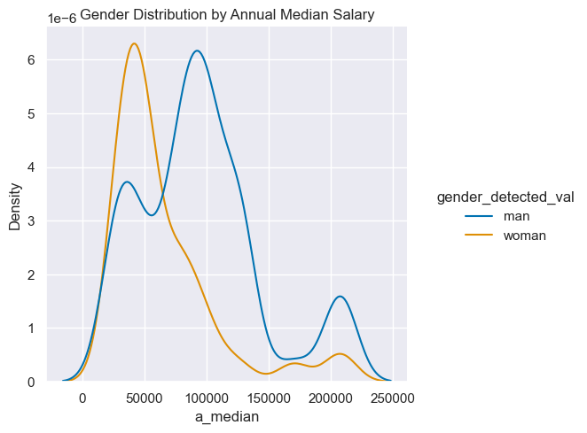

#### Detected Gender by Trait Sentiment
We also looked at the gender of generated "people" to determine how males and females were represented, based on the
trait sentiment within the prompt and found that women were much more likely (p=5.9e-11) to represent positive traits 
than men were, in our data.

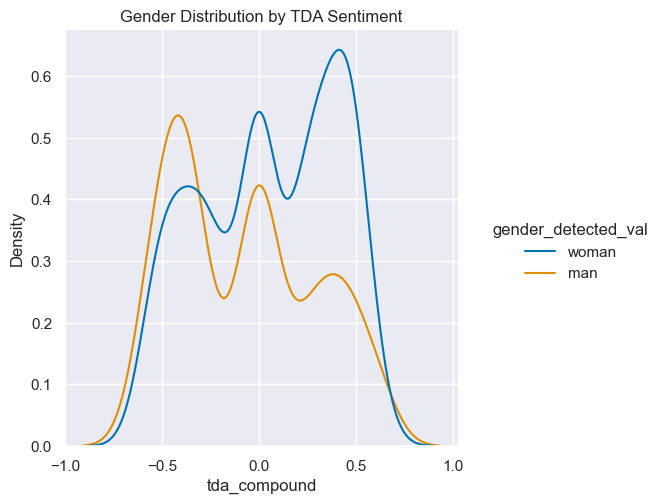

## Future Work

During processing of our data, we removed images with no face or faces that the Deepface model could not distinguish as either male or female. We classified these as 'no face' and 'unknown' respectively. It would be interesting in the future to analyze any trends in the prompts that produced these images. Reproducing our work with other image generation models such as Google's [Imagen](https://imagen.research.google/) or OpenAI's [DALL-E](https://openai.com/dall-e-2/) could provide insight on which prompts produce faceless images across the different models. Finally, while we focused on gender and perceived skin tone here, it may be worth analyzing trends in age or emotion in the future as well.


*****

[^1]: Serengil, Sefik & Ozpinar, Alper. (2020). LightFace: A Hybrid Deep Face Recognition Framework. 10.1109/ASYU50717.2020.9259802.

[^2]: Pizer, Stephen & Amburn, E. & Austin, John & Cromartie, Robert & Geselowitz, Ari & Greer, Thomas & ter Haar Romeny, Bart & Zimmerman, John & Zuiderveld, Karel. (1987). Adaptive Histogram Equalization and Its Variations. Computer Vision, Graphics, and Image Processing. 39. 355-368. 10.1016/S0734-189X(87)80186-X. 

[^3]: Zhang, Kaipeng & Zhang, Zhanpeng & Li, Zhifeng & Qiao, Yu. (2016). Joint Face Detection and Alignment Using Multitask Cascaded Convolutional Networks. IEEE Signal Processing Letters. 23. 10.1109/LSP.2016.2603342.

[^4]: Harville, Michael & Baker, Harlyn & Susstrunk, S.. (2005). Image-based measurement and classification of skin color. Proc IEEE Int Conf Image Process. 2. II - 374. 10.1109/ICIP.2005.1530070.

[^5]: Kolkur, S. & Kalbande, Dhananjay & Shimpi, P. & Bapat, C. & Jatakia, Janvi. (2017). Human Skin Detection Using RGB, HSV and YCbCr Color Models. 10.2991/iccasp-16.2017.51.

[^6]: Condon, David; Coughlin, Joshua; Weston, Sara, 2021, "Trait Descriptive Adjectives", [https://doi.org/10.7910/DVN/5T80PF](https://doi.org/10.7910/DVN/5T80PF), Harvard Dataverse, V3, UNF:6:vG7u+/RiNFqg5vQqoxPGbw== [fileUNF]

[^7]: Hutto, C.J. & Gilbert, E.E. (2014). VADER: A Parsimonious Rule-based Model for Sentiment Analysis of Social Media Text. Eighth International Conference on Weblogs and Social Media (ICWSM-14). Ann Arbor, MI, June 2014. 

[^8]: [Luma_(video)](https://en.wikipedia.org/wiki/Luma_(video))